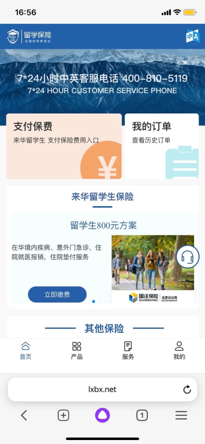
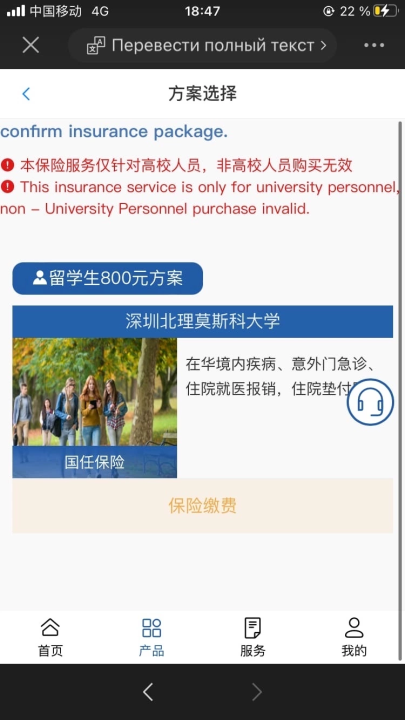
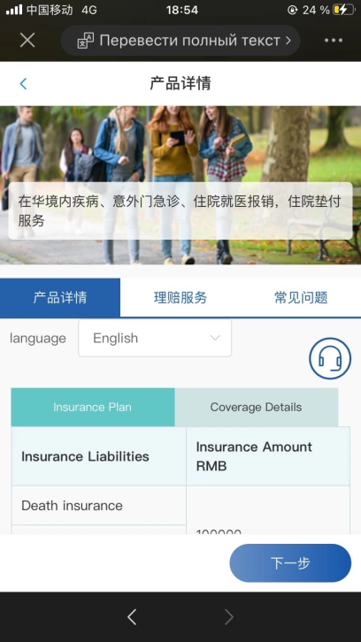
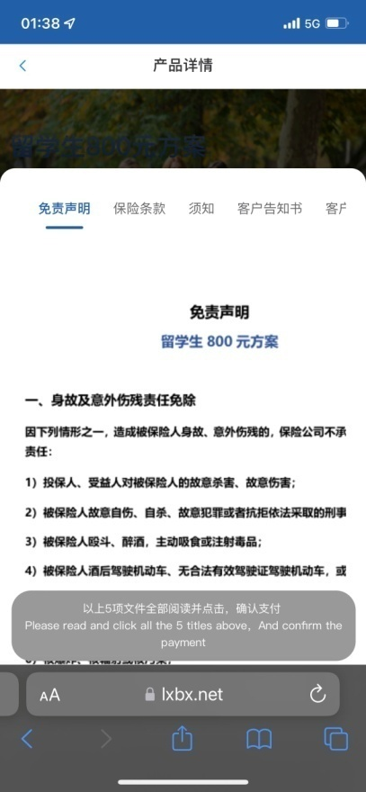
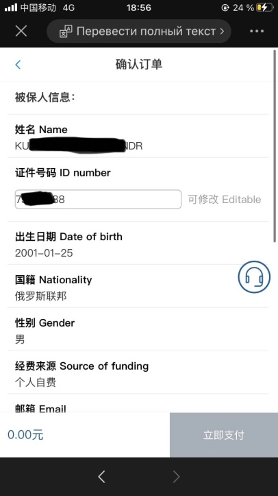
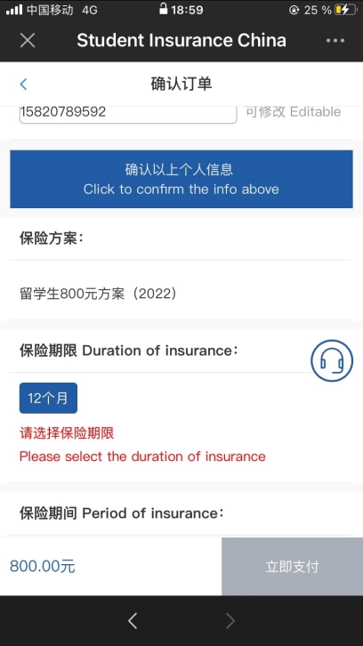

# Инструкция по оплате страховки

Инструкция по оплате страховки

Заполнение возможно из браузера телефона и через WeChat. Отличие заключатся в способах оплаты. В WeChat можно оплатить только через WeChatPay, в браузере есть оплата через Alipay. Иногда с телефона при переходе по ссылке в браузере нет варианта оплаты через Alipay, тогда стоит делать с компьютера по ссылке, последовательность действий аналогичная.

1. Переходим по ссылке или по QR коду:

 

1. На данной странице нажимаем на синюю кнопку с надписью “位即缴费”, которая находится слева от картинки. Обязательно проверьте, что вы выбираете страховку за 800 юаней. Цена написана в строчке “留学生800元方案”.

1. Нажимаем на синюю надпись под фото “国任保险“.

1. Нажимаем на синюю кнопку снизу справа “ 下一步 ”

1. На данной странице необходимо прочитать правила и согласится с ними. Для этого необходимо нажать на 5 надписей “免责声明”，“保险条款”，”须知” и остальные, написанные серым цветом. После этого нижняя серая кнопка “Please read and click all the 5 titles above, And confirm the payment” станет синей и на нее необходимо нажать.

1. Заполняем анкету. В графу “Name” пишем фамилию имя (как в загранпаспорте обязательно) большими буквами. “ID number” – номер паспорта без пробелов. В “Date of birth” указываем дату рождения, не забывая, что в Китае год-месяц-день. В “Nationality” выбираете из списка “Russia” и должны появиться иероглифы “俄罗斯朕邦”. В “Gender” указываем “女” если девушка, “男” если парень. В “Source of funding” выбираем источник дохода. Советуем указать семью. Вводим также почту и номер телефона. Далее нажимаем на синюю кнопку “Click to confirm the info above”. Нажимаем на кнопку “12个月” и кнопка “位即支付” из серой становится синей и на нее необходимо нажать.

1. Далее происходит оплата по WeChat или по Alipay в зависимости от того, какой способ заполнения вы выбрали.
