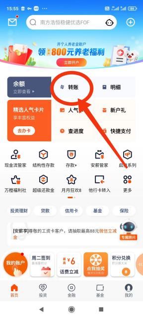
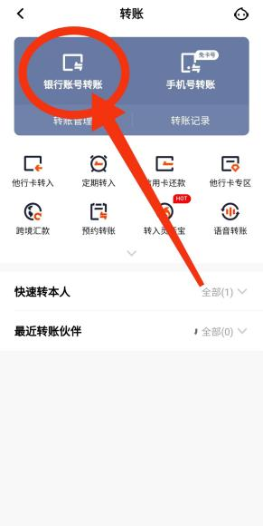

# Памятка об оплате обучения

Инструкция по оплате обучения

Существует несколько способов оплаты обучения:

1. В отделении PingAn банка;
2. Безналичный перевод на счёт университета;
3. Через мобильное приложение PingAn банка;
4. Автоплатёж;

1.В отделении PingAn банка.

Данный способ является самым простым и надёжным. После оформления банковской карточки и SIMкарты нужно прийти в отделение банка, находящееся на территории университета. С собой обязательно возьмите банковскую карточку, паспорт и сткденческую карточку. Затем подойдите к сотруднику банка и покажите ему необходимую фразу:

* Я хочу оплатить обучение - 我想缴纳学费。
* Я хочу заплатить за общежитие - 我想缴纳住宿费。
* Я хочу заплатить за обучение и за общежитие - 我想缴纳学费和住宿费。
* У меня с собой наличные, я хочу внести деньги на счёт - 我有现金、我想往帐户存钱。

После этого вашим делом займётся сотрудник банка, Вам нужно будет только указать необходимую сумму, вводить платёжный пароль или подтверждать согласие с условиями документов на специальном планшете. После окончания процедуры Вам будет выдан чек, обязательно сохраните его, а также не забудьте отправить фотографию чека ответственному за оплату обучения сотруднику администрации.

1. Безналичный перевод на счёт университета.

Если Вы планируете оплатить обучение из России, Вам необходимо купить юани (обменные курсы и адреса обменных пунктов можно найти в интернете, например, на сайте [http://www.banki.ru/products/currency/](http://www.banki.ru/products/currency/#message/_blank) ), обратиться в филиал одного из китайских банков, расположенных в РФ, открыть счет в юанях, внести на свой счет валюту и осуществить перевод средств на счет Университета (реквизиты для оплаты и подробную инструкцию обычно выдают вместе с приглашением, или же Вы можете найти реквизиты в данном документе ниже). Информацию о возможных комиссиях следует уточнять у сотрудников соответствующих банков.

Например, в Москве таким банком является Bank Of China на Проспекте Мира. Обратите внимание на часы работы, обычно банк закрывается в 16:30, нужно приехать заранее, так как процедура открытия счёта не очень быстрая. К тому же, студенту лучше приехать в банк лично и открыть счёт на своё имя, а не, например, на имя родителей, так как это позволит избежать оформления дополнительных бумаг при переводе средств.

Так же есть возможность перевести деньги без предварительной конвертации в юани через другие, не китайские банки. Информацию о возможности совершения SWIFT перевода, взимаемой комиссии и других условиях перевода стоит уточнять в интернете или непосредственно у службы поддержки или в отделении интересуемого банка. Необходимая сумма в юанях конвертируются в сумму в иностранной валюте на основе обменного курса (middle rate) Банка Китая по курсу, указанному на сайте Банка Китая ( [https://www.boc.cn/sourcedb/whpj/enindex\_1619.html](https://www.boc.cn/sourcedb/whpj/enindex_1619.html) ) на день перевода, и переводятся на счёт.

Реквизиты для оплаты **в юанях:**

**中文收款名称(Название адресата на китайском):** 深圳北理莫斯科大学

**英文名称(Название адресата на английском):** Shenzhen MSU-BIT University

**收款账号(Номер счёта):** 15000099401867

**开户行名称(Hазвание банка):** 平安银行股份有限公司

PING AN BANK CO. LTD. (FORMERLY SHENZHEN DEVELOPMENT BANK), H.O.,

**开户行地址(Адрес банка):** 深圳市罗湖区深南东路 5047 号深圳发展银行大厦

NO.5047 SHENNAN EAST ROAD SHENZHEN DEVELOPMENT BANK BUILDING, SHENZHEN, PRCHINA, 518000

**代码 (SWIFT код):** SZDBCNBS

Реквизиты для оплаты **в другой валюте:**

**中文收款名称(Название адресата на китайском):** 深圳北理莫斯科大学

**英文名称(Название адресата на английском):** Shenzhen MSU-BIT University

**收款账号(Номер счёта):** 4000028519201919178

**开户行名称(Hазвание банка):** 中国工商银行深圳市分行

INDUSTRIAL AND COMMERCIAL BANK OF CHINA, SHENZHEN BRANCH

**开户行地址(Адрес банка):** 中国深圳深南东路金融中心北座

NORTH BLOCK FINANCIAL CENTRE SHENZHEN ROAD EAST SHENZHEN CHINA

**代码 (SWIFT код):** ICBKCNBISZN

1. Через мобильное приложение PingAn банка.

| **Шаг 1**                                                                                       | **Шаг 2**                                                                                       | **Шаг 3**                                                                                           |
| ----------------------------------------------------------------------------------------------- | ----------------------------------------------------------------------------------------------- | --------------------------------------------------------------------------------------------------- |
|  |  |  |

У этого способа есть два очень важных ограничения - у Вас должна быть возможность получить SMS сообщение на привязанный к банковской карте номер телефона, а также Ваши имя и фамилия на английском языке не должны в сумме превышать 20 знаков.

1. Для оплаты обучения зайдите в приложение 平安口袋银行. Выберите 转账(переводы) на главной странице приложения, войдите в свою учётную запись.
2. Нажмите на 银行账号转账 (перевод по банковским реквизитам).
3. Заполните получателя, счёт получателя, требуемую к оплате сумму, Ваш номер телефона, имя и студенческий номер на английском (как указано в Вашем заграничном паспорте), заглавными буквами, без пробелов в формате SURNAMENAME1220\*\*\*\*\*\*.(это поле не может превышать 30 знаков!)

Получатель: 深圳北理莫斯科大学

Счёт получателя: 15000099401867

1. Подтвердите транзакцию и обязательно сделайте скриншот. Отправьте этот скриншот ответственному за оплату обучения сотруднику администрации.
2. Автоплатёж.

Если у студента возникают сложности с доступом к китайской банковской карте или номеру телефона, университет может предложить заполнить заявление на автоплатёж. Для этого будет назначен специальный работник, которому нужно будет направить заявление из Приложения 1. В установленный срок деньги будут автоматически списаны с Вашего счёта, обязательно проверьте в приложении банка, что транзакция была совершена успешно. Для этого введите в строке поиска 收支明细 (детализация доходов и расходов), выберите предложенный поисковиком вариант и найдите в списке транзакций необходимую сумму.

Если Вы не нашли искомую транзакцию, то возможно списание не произошло, обязательно сообщите об этом ответственному за автоплатёж или за оплату обучения сотруднику.

Приложение 1. Заявление на автоплатёж.

Rector of\
Shenzhen MSU-BIT University\
\***th** year student of\
**Faculty \*\*\*\***\
**Full name**\
&#xNAN;**(Full name на русском языке)**

**Application**

I am **IVANOV IVAN IVANOVICH**, my student ID is **1220XXXXX**, my PING AN bank card number is **xxxxxxxx**. I need the university to initiate a money transfer from my PING AN bank card to the university’s account, paying for my tuition of the 20&#x32;**\***/20&#x32;**\*** academic year, **\*** semester. I cannot do it by myself because \*\*\*\*\*.

**DATE**

**Signature (handwritten)**
