# Брошюра&#x20;

Общежитие

Инструкция по оплате коммунальных услуг

Guidelines for payment of utilities

1\. Нажмите на «Коммунальные услуги»

1\. Press on «Water and electricity payment»

2\. Оплата горячей воды/оплата электроэнергии

2\. Choose «Charge» or «Water filling»

3\. Введите пароль (6 последних цифр загран.паспорта) и далее

3\. Enter your password (last 6 digits of your passport) and continue

4\. Если оплачиваете электричество, введите номер комнаты по образцу: 1А-ХХХ (женское общежитие) и 1В-ХХХ (мужское общежитие)

4\. If you pay for electricity, enter your dormitory room number, referring to the example: 1A-XXX (for female dormitory) and 1B-XXX (for male dormitory)

5\. Если оплачиваете кондиционер, введите по образцу: 1А-К-ХХХ (женское общежитие) 1В-К-ХХХ

5\. If you are paying for the air conditioner, enter the number, referring to this example: 1A-K-XXX (for female dormitory) and 1B-K-XXX (for male dormitory)

6\. Введите сумму (максимум за воду - 50 юаней, за электричество – 500 юаней) и далее

6\. Enter the amount (Maximum for the water is 50 Rmb, for electricity is 500 Rmb) and continue

Инструкция по пополнению баланса студенческой карты

Guideline for replenishing the balance of student’s card

1\. Подойдите в 1 столовую к стойке, где стоят напитки в холодильнике и попросите китайского сотрудника пополнить студенческую карту. Принимают НАЛИЧКУ и WeChat Pay

1\. Come to the 1st canteen, then find a desk near the fridges with drinks and ask the employee to replenish your card. You can pay with cash or Wechat Pay.

Также можно пополнить через приложение «WeChat Кампус»

Also you can top up your campus card and pay for utilities using the «WeChat campus» app

1\) Перейдите по ссылке через WeChat

1\) Go through the link in Wechat.jpeg>)

2\) Введите номер студенческого и пароль (последние 6 цифр загранпаспорта)

2\) Enter the number of your student’s card and password (last 6 digits of your passport)

3\) Выберите язык (Китайский, Английский, Русский)

3\) Choose the language (Chinese, English or Russian).jpeg>)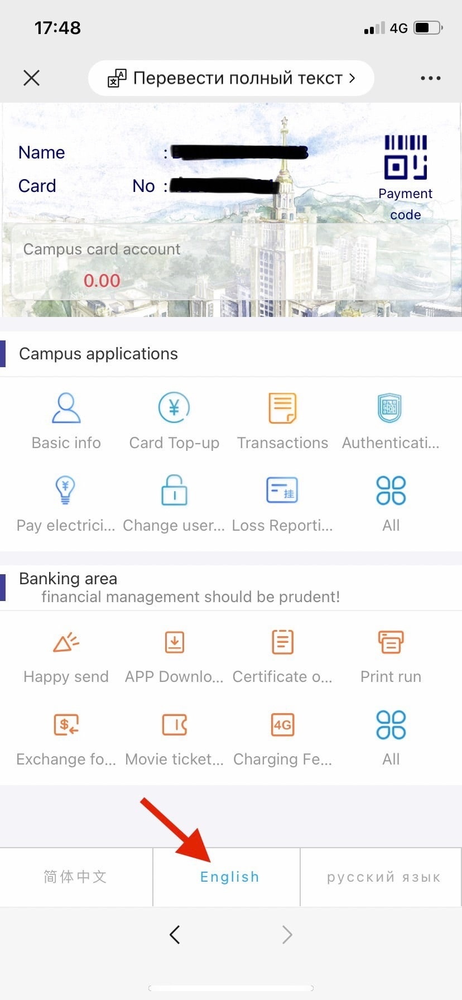

1\. Нажмите на «Пополнить карту» 卡片充值 Card Top-up

1\. Press the «Card Top-up» button.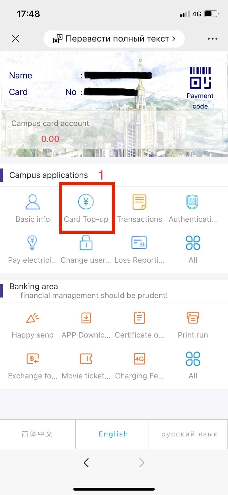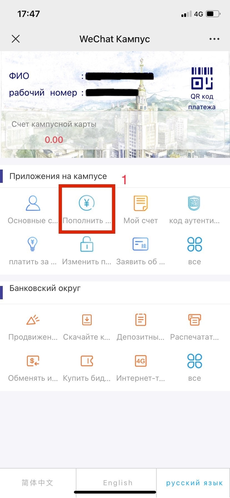

2\. Выберите способ оплаты (Банковской картой или кошельком Wechat)

2\. Choose the payment method (Via bank card or Wechat wallet).jpeg>).jpeg>)

3\. Введите необходимую сумму вручную или выберите один из предложенных вариантов

3\. Enter the required amount in fiat currency manually or choose one of the given variants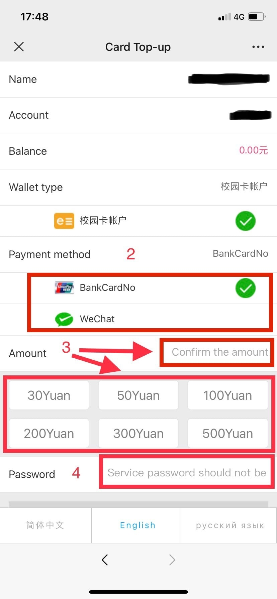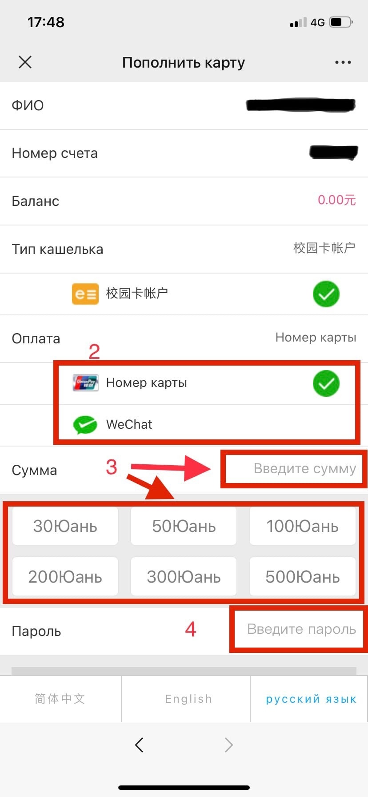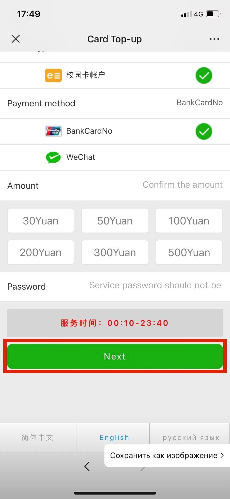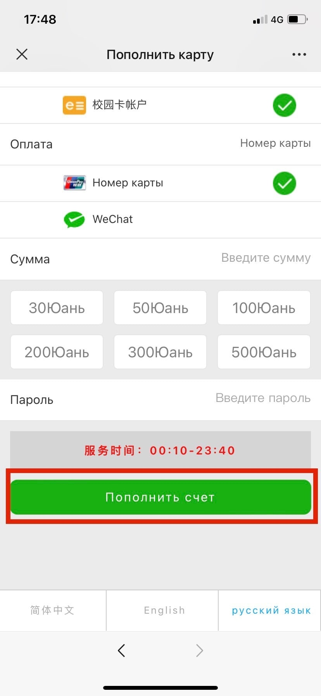

4\. Введите пароль (6 последних цифр загранпаспорта) и подтвердите пополнение

4\. Enter the password (last 6 digits of your passport) and confirm the payment

Инструкция по использованию стиральных машин

Guideline for washing machines

1\. Отсканируйте код на стиральной машине через WeChat

или приложение 海狸洗衣

1\. Scan a QR-code on the top of washing machine using WeChat or 海狸洗衣 app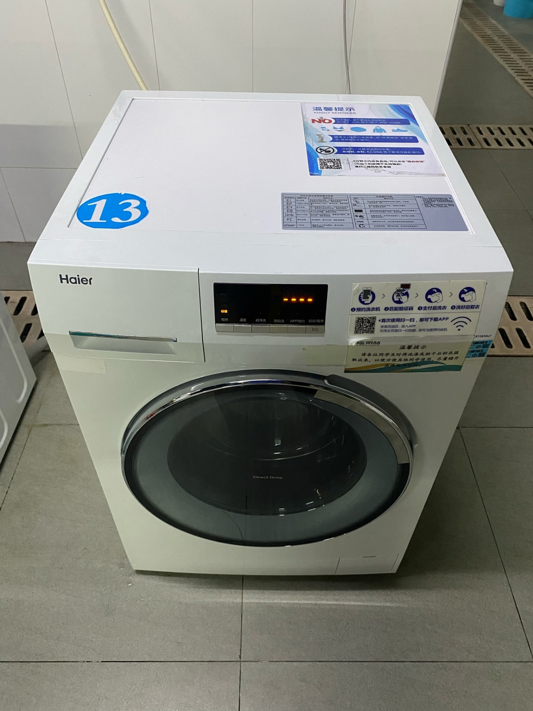

2\. Выберите режим

2\. Choose washing mode

· 标准 Стандартная стирка 40 минут 3 юаня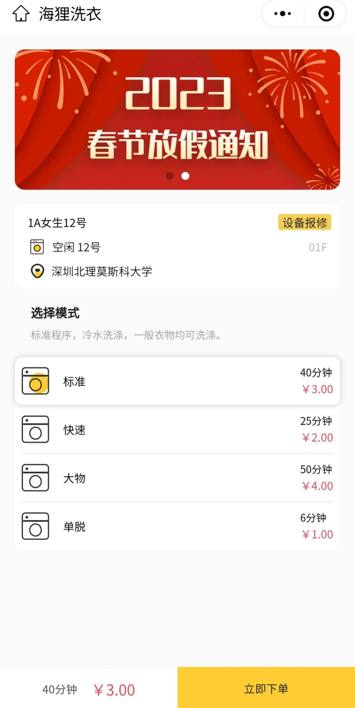

· 标准 Standart wash 40 minutes 3 Rmb

· 快速 Быстрая стирка 25 минут 2 юаня

· 快速 Fast wash 25 minutes 2 Rmb

· 大物 Большие вещи 50 минут 4 юаня

· 大物 Bed linen mode 50 minutes 4 Rmb

· 单脱 Отжим 6 минут 1 юань

· 单脱 Spinning laundry 6 minutes 1 Rmb

3\. Нажмите на 立即下单 и согласитесь со всеми требованиями

3\. Press the 立即下单 and confirm all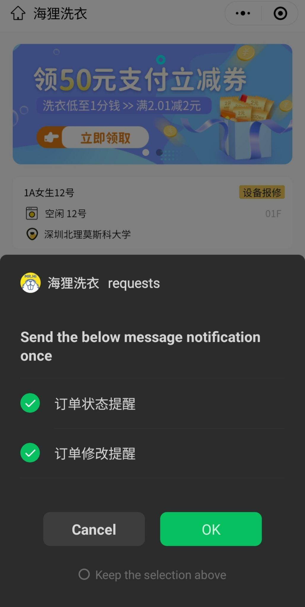

4\. Оплатите WeChat Pay (зеленая иконка) (确定付款), высветится уведомление, где надо нажать 确认

4\. Pay through the WeChat (green icon), then press 确定付款, and after it, press the 确认 button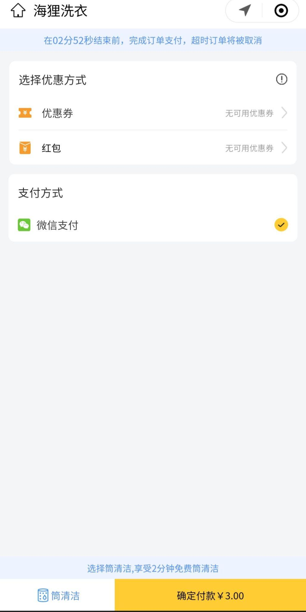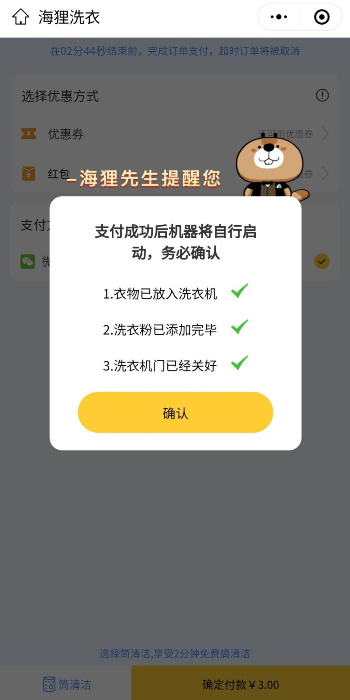

5\. Введите пароль от WeChat Pay

5\. Enter your WeChat Pay password

Инструкция по использованию сушильных машин

Guideline for drying machines

1. Отсканируйте QR - код на сушильной машине через WeChat, выберите нужный режим и произведите оплату

1\) Scan the QR code on the drying machine through the WeChat, choose preferred mode and make a payment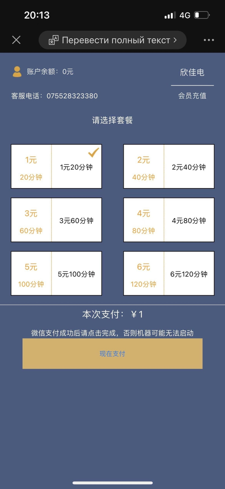

1. После проведения оплаты нажмите на кнопку включения машины

2\) After completing the payment press the power-on button

1. Нажмите на кнопку старт

3\) Press the start button

Также на крыше общежитий, на 10 этаже есть бесплатные сушилки для вещей. Время работы с 8:00 до 20:00.

Also you can find free dryers on the 10th floor. Doors are opened from 8:00 to 20:00.

Кладовые для чемоданов

После того как вы заселитесь в общежитие, чтобы чемоданы не занимали место, вы можете попросить у дежурной консьержки, чтобы они открыли вам кладовую на вашем этаже, чтобы положить туда ваш чемодан.

Storage rooms for suitcases

After you move into your room, you can ask the concierge to open a storage room to leave your suitcases there for a long-time keeping on your living floor.

Парикмахерская на территории кампуса

Hair salon in campus territory

1\. Используйте WeChat для сканирования QR-кода

1\. Scan this QR code through the WeChat

3\. Записаться на стрижку

3\. Register for a haircut

4\. Выбрать день и время, нажать на кнопку бронирования

4\. Choose date and press the register button

5\. Введите ФИО и номер телефона, куда Вам придет уведомление.

5\. Write down your Name and phone number, you will receive a notification.

6\. Покажите сообщение парикмахеру

6\. Show notification to a barber

Библиотека

Library

Инструкция по бронированию комнаты в библиотеке

Instruction for booking a room in the Library

1\. Поднимитесь на 2 этаж и подойдите к стойке регистрации

1\. Go to the 2nd floor and come to the check-in desk.

2\. Скажите китайским сотрудникам, какую комнату хотели бы забронировать

2\. Tell the employee which room you would like to book.

· 研修室 Carrel Кабинет для индивидуальной работы (Максимальное время – 1 час)

· 研修室 Carrel (Maximum booking time is 1 hour)

· 研讨室 Group Learning Room Комната для групповой работы (Максимальное время – 4 часа)

· 研讨室 Group Learning Room (Maximum booking time is 4 hours)

3\. Заполните бланк 研修室预约登记表

3\. Fill in the blank 研修室预约登记表

· 姓名 Surname and Name Фамилия и Имя

· 读者证号 Student No. Номер студенческого билета

· 手机号码 Phone number Номер телефона

· 预约房间号 Reservation room number Номер забронированной комнаты

· 借出时间 Booking start time Время начала бронирования

· 借出签名 Write your Name or Sign Напишите свою Фамилию и Имя или поставьте подпись

4\. Подойдите к Self-check in\&out desk со студенческой и полученной карточкой для комнаты (слева от стойки регистрации)

4\. Go to the Self-check in\&out desk with the student and the received room card (to the left of the reception desk)

· 借书 Borrow books одолжить книги

· 证件感应区 Card sensor zone (student card) Приложить студенческий

· 图书感应区 Book sensor zone (put the received room card on sensor) Приложите полученную карточку для комнаты

· 借书 Click on the student card number button on the screen and then green buttom «借书». Сначала нажать на экране на номер студенческой карты, потом на «借书»

5\. Если желаете продлить время, повторите пункты 1-4

5\. If you want to extend the time, repeat steps 1-4

6\. Когда время истекло, спуститесь на 2 этаж, найдите свое имя и внесите в бланк данные

6\. When the time is up, go down to the 2nd floor, find your name and fill the blank

· 归还时间 Card return time Время возврата карты

· 归还签名 Write your Name or Sign Фамилия и Имя

7\. Верните карточку!!! Please don’t forget to return the card!!!

Взять книгу

Borrow books

· Подойдите к Self-check in\&out desk со студенческой картой и книгой.

· Come to the Self-check in\&out desk with your student’s card and book, that you want to borrow.

· 借书 Borrow books Одолжить книги

· Press the 借书 Borrow books button

· 证件感应区 Card sensor zone (student card) Приложить студенческую карточку

· Then attach your student’s card to the sensor zone

· 图书感应区 Положите книгу

· Put your book

· 借书 Нажать на «借书» (借出成功 Бронь прошла успешно)

· Press the «借书» button. Successfully borrowed (借出成功)

Вернуть книгу

Book returning

· Подойдите к Self-check in\&out desk со студенческой картой и книгой

· Come to the Self-check in\&out desk with your student’s card and book

· 还书 Return books Вернуть книги

· Press the 还书 button

· 图书感应区 Положите книгу

· Put down your book

· 还书 Вернуть книгу (正在归还 Возврат прошел успешно)

· Press the 还书 button. 正在归还 (returned successfully)

Банк

Bank

Банк находится в здании общежития Магистрантов, корпус А. Вы можете обратиться к сотрудникам банка по вопросам студенческой карты, банковской карты 平安 или по обмену валюты. Сотрудники знают Китайский и Английский языки.

Также, рядом с отделением банка находится банкомат.

Bank is located in the dormitory of Master degree students, A building.

You can ask bank’s employees to help you with student’s card, 平安 bank’s card or currency exchange. Employees can speak English and Chinese.

Also, there is an ATM near to the bank.&#x20;
